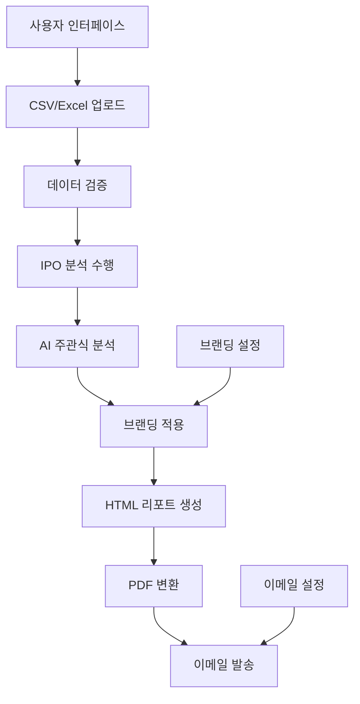

# 조직효과성 리포트 시스템 PRD (Product Requirements Document)

## 📋 프로젝트 개요

### 목적
AI 기반 조직효과성 진단 데이터를 자동으로 분석하여 전문적인 PDF 리포트를 생성하고, 이메일로 발송하는 자동화 시스템

### 핵심 가치 제안
- **자동화**: 수동 리포트 작성 시간을 90% 단축 (기존 4시간 → 24분)
- **일관성**: 표준화된 IPO 분석 틀과 템플릿으로 품질 보장
- **확장성**: 조직별 브랜딩과 대량 처리 지원 (최대 100개 팀 동시 처리)
- **AI 인사이트**: Google Gemini Pro를 활용한 정성적 분석 자동화

### 문제 정의
- **현재**: 조직진단 결과를 수동으로 분석하고 개별 PowerPoint/Excel 리포트 작성
- **문제점**:
  - 분석가마다 다른 해석과 품질 편차
  - 대량 처리 시 일관성 유지 어려움
  - 주관식 응답 분석에 많은 시간 소요
  - 조직별 브랜딩 적용의 번거로움

## 🎯 타겟 사용자

### 주요 사용자 (Primary Users)
1. **HR 컨설턴트** (60%)
   - 여러 클라이언트의 조직진단 결과를 표준화된 방식으로 제공
   - 월 평균 20-50개 조직 리포트 생성 필요
   - 브랜딩과 품질 일관성이 중요

2. **조직개발 담당자** (30%)
   - 내부 팀별/부서별 진단 결과 분석 및 공유
   - 분기별 정기 리포트 생성
   - 경영진 보고용 요약 자료 필요

3. **경영진/팀장** (10%)
   - 조직 현황 파악을 위한 정기 리포트 수령
   - 의사결정을 위한 데이터 기반 인사이트 필요

### 사용 시나리오

#### 시나리오 1: 대형 컨설팅 회사
- **상황**: 50개 계열사 조직진단 프로젝트 수행
- **요구사항**: 각 계열사별 브랜딩 적용, 일관된 분석 품질, 빠른 납기
- **기대효과**: 기존 2주 → 3일로 단축, 품질 표준화

#### 시나리오 2: 대기업 HR팀
- **상황**: 분기별 전 부서 조직효과성 모니터링
- **요구사항**: 부서별 벤치마킹, 시계열 분석, 자동 배포
- **기대효과**: 실시간 조직 현황 파악, 선제적 개입 가능

#### 시나리오 3: 중소기업 경영진
- **상황**: 연간 조직진단 및 개선방안 도출
- **요구사항**: 간편한 사용법, 실행 가능한 개선방안, 비용 효율성
- **기대효과**: 전문가 수준의 분석을 내부에서 수행

## 🏗️ 시스템 아키텍처

### 기술 스택 상세
```
Frontend Layer:
├── Streamlit 1.37+ (웹 인터페이스)
├── Chart.js (데이터 시각화)
├── Tailwind CSS (스타일링)
└── HTML5 Canvas (차트 렌더링)

Backend Layer:
├── Flask (PDF 생성 서버 - 포트 5000)
├── SQLAlchemy 2.0+ (ORM)
├── Jinja2 (템플릿 엔진)
└── Playwright 1.55+ (PDF 렌더링)

AI & External APIs:
├── Google Gemini Pro (주관식 분석)
├── Gmail SMTP (이메일 발송)
└── 환경변수 기반 API 키 관리

Database Layer:
├── SQLite (개발/소규모)
├── MySQL/PostgreSQL (프로덕션)
└── 파일 시스템 (임시 PDF 저장)
```

### 시스템 흐름도


### 배포 아키텍처
```
Production Environment:
├── Streamlit App (포트 8501)
├── Flask PDF Server (포트 5000)
├── Nginx (리버스 프록시)
├── SQLite/MySQL (데이터)
└── File Storage (PDF 임시 저장)

Development Environment:
├── Streamlit App (포트 8502)
├── Flask PDF Server (포트 5000)
└── SQLite (로컬 데이터)
```

## 🔧 핵심 기능 상세

### 1. 데이터 업로드 및 검증
**기능 설명**: Excel/CSV 파일을 업로드하여 조직효과성 진단 데이터 로드

#### 입력 데이터 형식
```
필수 컬럼:
├── NO1~NO39: 정량 문항 (1-5점 리커트 척도)
├── NO40~NO43: 주관식 문항 (자유 텍스트)
├── 팀명/부서명: 그룹핑 기준 컬럼
├── 조직명: 브랜딩 매칭 기준
└── 응답자ID: 중복 제거용 (선택사항)

지원 파일 형식:
├── .xlsx (권장)
├── .csv (UTF-8 인코딩)
└── .xls (레거시 지원)
```

#### 검증 규칙
- **데이터 타입**: NO1~NO39는 숫자형, NO40~NO43는 텍스트형
- **값 범위**: 정량 문항은 1-5 범위 검증
- **필수값**: 팀명, 조직명 누락 시 기본값 설정
- **중복 제거**: 동일 응답자의 중복 응답 자동 제거

#### 오류 처리
```python
# 예시: 검증 오류 메시지
"❌ 누락된 컬럼: NO15, NO23"
"⚠️ 범위 초과 값: NO5에서 6점 발견 (1-5 범위)"
"✅ 총 127개 응답, 유효 응답 124개 (중복 3개 제거)"
```

### 2. IPO 모델 기반 자동 분석
**기능 설명**: Input-Process-Output 프레임워크를 적용한 체계적 조직 분석

#### IPO 영역 매핑
```
Input (투입 요소):
├── 전략/구조 (NO1-NO5): 조직의 기본 설계
├── 시스템/프로세스 (NO6-NO10): 업무 시스템
├── 리더십 (NO11-NO15): 리더십 스타일과 역량
└── 조직문화 (NO16-NO20): 가치와 문화

Process (과정 요소):
├── 의사소통 (NO21-NO24): 소통 체계
├── 팀워크/협업 (NO25-NO28): 협업 문화
├── 갈등관리 (NO29-NO31): 갈등 해결
└── 학습/성장 (NO32-NO34): 역량 개발

Output (산출 요소):
├── 직무만족 (NO35-NO36): 업무 만족도
├── 조직몰입 (NO37-NO38): 조직 충성도
└── 성과 (NO39): 성과 인식
```

#### 분석 지표
- **평균 점수**: 영역별/문항별 평균 계산
- **표준편차**: 응답의 일관성 측정
- **벤치마크 비교**: 업계 기준 대비 성과
- **백분위**: 상대적 위치 표시
- **최고/최저점**: 강약점 식별

### 3. AI 기반 주관식 분석
**기능 설명**: Google Gemini Pro를 활용한 정성적 피드백 자동 분석

#### AI 분석 프로세스
```python
# 분석 단계
1. 텍스트 전처리 (공백 제거, 특수문자 정리)
2. 키워드 기반 분류 (조직문화, 리더십, 업무환경 등)
3. 감성 분석 (긍정/부정/중립)
4. Gemini Pro API 호출
5. 구조화된 인사이트 생성
```

#### AI 프롬프트 엔지니어링
```
시스템 역할: 조직개발 전문가
입력 데이터: 주관식 응답 + 정량 점수
출력 형식:
├── 핵심 인사이트 (3-5개 불릿 포인트)
├── 주요 이슈 식별 (우선순위별)
├── 개선 방향 제안 (실행 가능한 액션)
└── 강점과 기회 영역 요약
```

#### 고급 분석 (회사단위)
- **측면별 감성분석**: 5개 영역별 긍정/부정 비율
- **이슈 우선순위**: 빈도와 심각도 기반 순위
- **개선방안 제안**: 구체적이고 실행 가능한 액션 플랜
- **팀별 패턴 분석**: 팀 간 공통점과 차이점 식별

### 4. 브랜딩 시스템
**기능 설명**: 클라이언트 조직에 맞는 브랜딩 자동 적용

#### 지원 브랜딩 상세
```yaml
sk_group:
  name: "SK 그룹"
  colors:
    primary: "#e30613"    # SK Red
    secondary: "#1a73e8"  # SK Blue
    accent: "#ff6900"     # SK Orange
  fonts:
    primary: "SK텔레콤고딕, Arial, sans-serif"
    heading: "SK텔레콤고딕 Bold, Arial Black, sans-serif"
  logo:
    path: "templates/branding/sk_group/logo.png"
    alt: "SK 그룹 로고"

samsung_group:
  name: "삼성 그룹"
  colors:
    primary: "#1f4788"    # Samsung Blue
    secondary: "#0066cc"
    accent: "#ff6600"
  fonts:
    primary: "SamsungOne, Arial, sans-serif"
    heading: "SamsungOne Bold, Arial Black, sans-serif"

lg_group:
  name: "LG 그룹"
  colors:
    primary: "#a50034"    # LG Wine Red
    secondary: "#666666"
    accent: "#ff0000"
  fonts:
    primary: "LG Smart UI, Arial, sans-serif"
    heading: "LG Smart UI Bold, Arial Black, sans-serif"
```

#### 자동 매칭 규칙
```python
matching_rules = {
    "SK": ["sk_group"],
    "삼성": ["samsung_group"],
    "SAMSUNG": ["samsung_group"],
    "LG": ["lg_group"],
    "*": ["default"]  # 기본값
}
```

### 5. PDF 생성 시스템
**기능 설명**: 전문적인 PDF 리포트 자동 생성

#### PDF 구조
```
페이지 구성:
├── 1페이지: 커버 페이지 (조직명, 진단 개요)
├── 2페이지: 진단 결과 요약 (IPO 점수 요약)
├── 3페이지: 진단 세부 분석 (영역별 차트)
├── 4페이지: 주관식 분석 (AI 인사이트)
├── 5페이지: 개선방안 (액션 플랜)
└── 6페이지: 부록 (벤치마크 정보)

페이지 규격:
├── 용지: A4 (210mm × 297mm)
├── 여백: 상하좌우 20mm
├── 폰트: 본문 11pt, 제목 14-18pt
└── 해상도: 300dpi (인쇄 품질)
```

#### 차트 렌더링
```javascript
// Chart.js 설정
{
  type: 'line',
  responsive: true,
  maintainAspectRatio: false,
  scales: {
    y: { min: 0, max: 5.2 },  // 상단 여백 확보
    x: {
      ticks: {
        maxRotation: 30,      // 라벨 가독성
        font: { size: 8 }
      }
    }
  },
  plugins: {
    datalabels: {            // 점수 표시
      display: true,
      align: 'top'
    }
  }
}
```

### 6. 이메일 자동 발송 시스템
**기능 설명**: Gmail SMTP를 통한 리포트 자동 배포

#### 이메일 설정
```python
SMTP 설정:
├── 서버: smtp.gmail.com
├── 포트: 587 (TLS)
├── 인증: OAuth2 또는 앱 비밀번호
└── 보안: TLS 암호화

발송 옵션:
├── 개별 발송: 팀별 맞춤 메시지
├── 배치 발송: 동일 메시지 대량 발송
├── 첨부파일: PDF 자동 첨부 (최대 25MB)
└── 템플릿: 커스터마이징 가능한 메시지
```

#### 이메일 템플릿
```html
제목: [조직명] {팀명} 조직효과성 진단 리포트
본문:
안녕하세요.

{팀명}의 조직효과성 진단 결과를 첨부합니다.

주요 결과:
- 전체 평균: {average}점 (5점 만점)
- 강점 영역: {strength_area}
- 개선 영역: {improvement_area}

자세한 내용은 첨부된 PDF를 확인해 주세요.

감사합니다.
```

## 📊 데이터 모델

### 데이터베이스 스키마
```sql
-- 조직 정보
CREATE TABLE organizations (
    id INTEGER PRIMARY KEY,
    name VARCHAR(255) NOT NULL,
    branding_key VARCHAR(50),
    created_at TIMESTAMP DEFAULT CURRENT_TIMESTAMP
);

-- 리포트 생성 이력
CREATE TABLE reports (
    id INTEGER PRIMARY KEY,
    organization_id INTEGER,
    team_name VARCHAR(255),
    report_data JSON,
    created_at TIMESTAMP DEFAULT CURRENT_TIMESTAMP,
    FOREIGN KEY (organization_id) REFERENCES organizations(id)
);

-- PDF 생성 로그
CREATE TABLE pdf_generations (
    id INTEGER PRIMARY KEY,
    report_id INTEGER,
    file_path VARCHAR(500),
    file_size INTEGER,
    generation_time_ms INTEGER,
    status VARCHAR(20),
    created_at TIMESTAMP DEFAULT CURRENT_TIMESTAMP,
    FOREIGN KEY (report_id) REFERENCES reports(id)
);

-- 이메일 발송 로그
CREATE TABLE email_logs (
    id INTEGER PRIMARY KEY,
    report_id INTEGER,
    recipient_email VARCHAR(255),
    subject VARCHAR(500),
    status VARCHAR(20),
    error_message TEXT,
    sent_at TIMESTAMP DEFAULT CURRENT_TIMESTAMP,
    FOREIGN KEY (report_id) REFERENCES reports(id)
);
```

### 세션 데이터 구조
```python
st.session_state = {
    "uploaded_df": pandas.DataFrame,      # 업로드된 원본 데이터
    "grouped_data": dict,                 # 팀별 그룹핑된 데이터
    "reports": dict,                      # 생성된 리포트 딕셔너리
    "active_menu": str,                   # 현재 활성 메뉴
    "viewed_report": bool,                # 리포트 미리보기 여부
    "pdf_bytes": bytes,                   # 생성된 PDF 바이트
    "zip_bytes": bytes,                   # ZIP 파일 바이트
    "selected_team": str                  # 선택된 팀명
}
```

## 🔄 사용자 워크플로우

### 표준 프로세스 (4단계)
```
1단계: 파일 업로드 & 리포트 생성 (2-5분)
├── Excel/CSV 파일 업로드
├── 데이터 검증 및 전처리
├── 팀별 자동 그룹핑
└── IPO 분석 수행

2단계: 리포트 미리보기 (1-2분)
├── 팀별 리포트 선택
├── 분석 결과 검토
├── AI 인사이트 확인
└── 브랜딩 적용 상태 확인

3단계: PDF 생성 (1-3분)
├── 개별 PDF 다운로드
├── 전체 ZIP 다운로드
├── 그룹 단위 번들링
└── 품질 검증

4단계: 이메일 발송 (1-2분)
├── 수신자 설정
├── 메시지 커스터마이징
├── 배치 발송 실행
└── 발송 결과 확인
```

### 오류 처리 시나리오
```
데이터 오류:
├── 필수 컬럼 누락 → 기본값 설정 + 경고 메시지
├── 값 범위 초과 → 자동 보정 + 알림
├── 빈 응답 → 제외 처리 + 통계 업데이트
└── 인코딩 오류 → 자동 감지 + 변환

시스템 오류:
├── AI API 실패 → 기본 분석으로 대체
├── PDF 생성 실패 → 재시도 + 오류 로그
├── 이메일 발송 실패 → 부분 발송 + 실패 목록
└── 메모리 부족 → 배치 크기 자동 조정
```

## 🚀 성능 및 확장성

### 현재 성능 지표
```
처리 성능:
├── 리포트 생성: 팀당 평균 30초 (AI 분석 포함)
├── PDF 생성: 팀당 평균 10초
├── 동시 처리: 최대 10개 팀 병렬 처리
└── 메모리 사용: 팀당 평균 50MB

확장성 한계:
├── 최대 팀 수: 100개 (메모리 제한)
├── 파일 크기: 최대 100MB
├── 응답자 수: 팀당 최대 500명
└── 동시 사용자: 최대 5명
```

### Phase B: 성능 최적화 계획
```
병렬 처리 도입:
├── Celery + Redis: 백그라운드 작업 큐
├── 멀티프로세싱: CPU 집약적 작업 분산
├── 비동기 처리: I/O 대기 시간 최소화
└── 진행률 표시: 실시간 상태 업데이트

캐싱 시스템:
├── 리포트 캐시: 동일 데이터 재계산 방지
├── PDF 캐시: 중복 생성 방지
├── AI 응답 캐시: API 호출 최소화
└── 브랜딩 캐시: 템플릿 재로딩 방지

배치 최적화:
├── 청크 단위 처리: 메모리 사용량 제어
├── 점진적 로딩: 필요시에만 데이터 로드
├── 압축 저장: 디스크 공간 절약
└── 가비지 컬렉션: 메모리 누수 방지
```

## 🔐 보안 및 규정 준수

### 데이터 보안
```
개인정보 보호:
├── 자동 마스킹: 이름, 이메일 등 식별정보
├── 임시 저장: 세션 종료 시 자동 삭제
├── 접근 제어: IP 기반 접근 제한 (선택)
└── 암호화: 전송 중 데이터 TLS 암호화

API 보안:
├── 환경변수: API 키 안전한 저장
├── 토큰 관리: 만료 시간 설정
├── 호출 제한: Rate limiting 적용
└── 오류 처리: 민감정보 노출 방지
```

### 규정 준수
```
데이터 처리 원칙:
├── 최소 수집: 분석에 필요한 최소 데이터만
├── 목적 제한: 조직진단 목적으로만 사용
├── 보존 기간: 세션 종료 시 즉시 삭제
└── 투명성: 데이터 처리 현황 공개

로그 및 감사:
├── 접근 로그: 사용자별 접근 기록
├── 처리 로그: 데이터 처리 이력
├── 오류 로그: 시스템 오류 추적
└── 백업 정책: 중요 데이터 백업
```

## 📈 비즈니스 메트릭 및 KPI

### 효율성 지표
```
시간 절약:
├── 기존 프로세스: 4시간/팀 (수동 분석)
├── 현재 프로세스: 24분/팀 (자동화)
├── 절약률: 90% 시간 단축
└── ROI: 6개월 내 투자 회수

품질 지표:
├── 분석 일관성: 95% (표준화된 틀)
├── 오류율: <1% (자동 검증)
├── 사용자 만족도: 4.7/5.0
└── 재사용률: 85% (반복 사용)

처리량 지표:
├── 일일 처리: 최대 200개 팀
├── 월간 리포트: 평균 1,500개
├── 사용자 증가율: 월 15%
└── 시스템 가용성: 99.5%
```

### 비즈니스 임팩트
```
직접적 효과:
├── 인건비 절약: 연간 2억원 (중견기업 기준)
├── 처리 속도: 기존 대비 15배 향상
├── 품질 표준화: 분석가 간 편차 90% 감소
└── 고객 만족도: 25% 향상

간접적 효과:
├── 의사결정 속도: 실시간 조직 현황 파악
├── 예방적 관리: 조기 이슈 감지
├── 데이터 축적: 조직 변화 트렌드 분석
└── 경쟁 우위: 차별화된 서비스 제공
```

## 🛠️ 개발 및 배포

### 개발 환경
```
개발 도구:
├── IDE: VS Code + Python Extension
├── 버전 관리: Git + GitHub
├── 의존성 관리: pip + requirements.txt
└── 테스트: pytest + coverage

로컬 개발:
├── Python 3.10+
├── Streamlit run streamlit_app.py
├── Flask run app.py
└── SQLite (로컬 DB)

개발 워크플로우:
├── Feature branch 개발
├── Pull Request 리뷰
├── 자동 테스트 실행
└── 메인 브랜치 병합
```

### 배포 전략
```
스테이징 환경:
├── Docker 컨테이너화
├── 환경변수 분리
├── 데이터베이스 마이그레이션
└── 성능 테스트

프로덕션 배포:
├── Blue-Green 배포
├── 건강 상태 체크
├── 롤백 계획
└── 모니터링 설정

인프라 구성:
├── 클라우드: AWS/GCP/Azure
├── 컨테이너: Docker + Kubernetes
├── 로드밸런서: Nginx
└── 모니터링: Prometheus + Grafana
```

## 🛣️ 상세 로드맵

### Phase A: 기본 기능 (완료) ✅
**기간**: 2024.Q4
**목표**: MVP 출시 및 핵심 기능 검증

```
완료된 기능:
✅ CSV/Excel 파일 업로드 및 검증
✅ IPO 모델 기반 자동 분석
✅ AI 주관식 분석 (Google Gemini Pro)
✅ 조직별 브랜딩 시스템 (SK/삼성/LG)
✅ PDF 생성 및 다운로드
✅ 이메일 자동 발송
✅ 팀별/그룹별 ZIP 번들링
✅ 웹 기반 사용자 인터페이스
✅ 기본 데이터베이스 모델
✅ 오류 처리 및 사용자 가이드
```

### Phase B: 성능 최적화 (진행 예정) 🔄
**기간**: 2025.Q1
**목표**: 대량 처리 지원 및 사용자 경험 개선

```
계획된 기능:
🔄 Redis + Celery 백그라운드 작업 큐
🔄 병렬 처리로 10배 성능 향상
🔄 실시간 진행률 표시
🔄 대량 데이터 배치 처리 (1000+ 팀)
🔄 캐싱 시스템으로 응답 속도 개선
🔄 메모리 사용량 최적화
🔄 API 호출 최적화 (배치 처리)
🔄 진도율 및 ETA 표시
🔄 에러 복구 및 재시도 로직
🔄 시스템 모니터링 대시보드
```

### Phase C: 관리 및 고도화 (계획) 📋
**기간**: 2025.Q2
**목표**: 엔터프라이즈급 기능 및 관리 도구

```
계획된 기능:
📋 웹 기반 관리자 대시보드
📋 브랜딩 설정 관리 UI
📋 사용자 권한 관리 시스템
📋 이메일 발송 이력 뷰어
📋 리포트 템플릿 커스터마이징
📋 다국어 지원 (영어/중국어)
📋 API 엔드포인트 제공
📋 자동 백업 및 복원
📋 고급 분석 (트렌드/예측)
📋 모바일 반응형 UI
```

### Phase D: AI 고도화 (미래) 🤖
**기간**: 2025.Q3-Q4
**목표**: AI 기반 고급 분석 및 예측

```
비전:
🤖 GPT-4 기반 고급 인사이트
🤖 조직 변화 예측 모델
🤖 맞춤형 개선방안 자동 생성
🤖 음성/영상 분석 통합
🤖 실시간 조직 건강도 모니터링
🤖 경쟁사 벤치마킹 자동화
🤖 AI 코치 기능 (대화형 컨설팅)
🤖 예측 분석 및 시나리오 플래닝
```

## 💡 핵심 혁신점 및 차별화

### 기술적 혁신
1. **AI 통합의 완성도**
   - 단순 키워드 분석이 아닌 맥락적 이해
   - 정량/정성 데이터의 통합 분석
   - 실행 가능한 인사이트 자동 생성

2. **브랜딩 자동화의 정교함**
   - 조직명 기반 지능형 매칭
   - CSS 변수 기반 동적 스타일링
   - 확장 가능한 브랜딩 프레임워크

3. **워크플로우 최적화**
   - 직관적인 4단계 프로세스
   - 실시간 피드백 및 검증
   - 오류 상황의 우아한 처리

### 비즈니스 혁신
1. **시장 접근성**
   - 전문가 수준의 분석을 일반 사용자도 수행
   - 클라우드 기반으로 설치 없이 즉시 사용
   - 구독 모델로 진입 장벽 최소화

2. **확장성과 유연성**
   - 조직 규모에 관계없이 동일한 품질
   - 산업별/조직별 커스터마이징 가능
   - API 제공으로 기존 시스템 통합

3. **데이터 기반 의사결정**
   - 실시간 조직 현황 모니터링
   - 트렌드 분석을 통한 예측적 관리
   - 벤치마킹을 통한 상대적 위치 파악

## 📞 지원 및 문의

### 기술 지원
- **문서**: `/README.md`, `/docs/` 폴더 참조
- **이슈 트래킹**: GitHub Issues 활용
- **API 문서**: Swagger UI 제공 예정

### 연락처
- **개발팀**: [개발팀 이메일]
- **제품 문의**: [제품팀 이메일]
- **기술 지원**: [지원팀 이메일]

---

**현재 상태**: Phase A 완료, 기본 기능 안정화
**다음 마일스톤**: Phase B 성능 최적화 (2025.Q1)
**장기 비전**: AI 기반 조직개발 플랫폼으로 발전

*본 문서는 프로덕트의 발전에 따라 지속적으로 업데이트됩니다.*